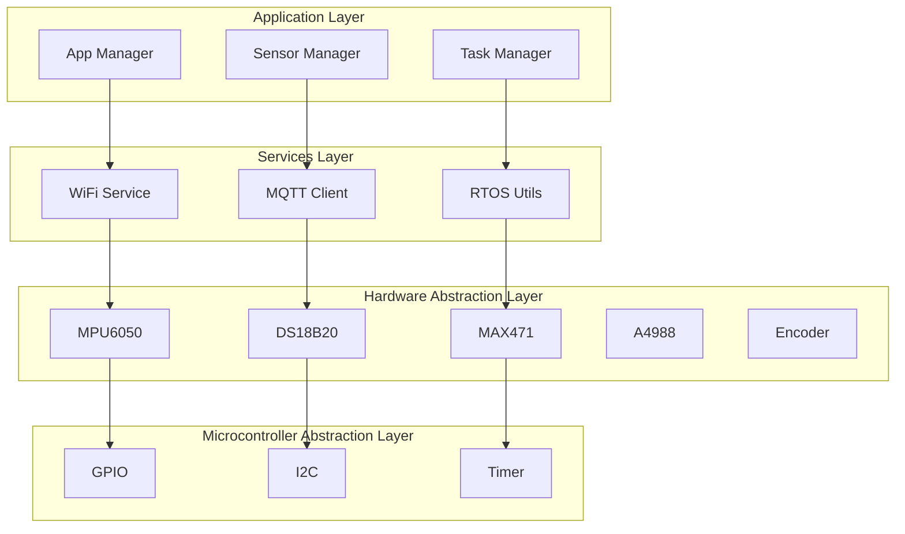
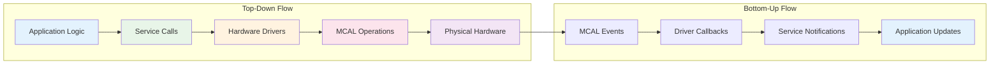
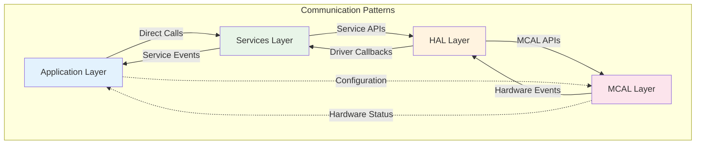
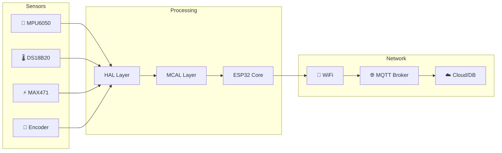
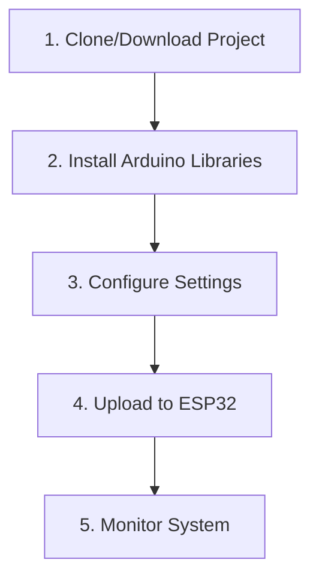
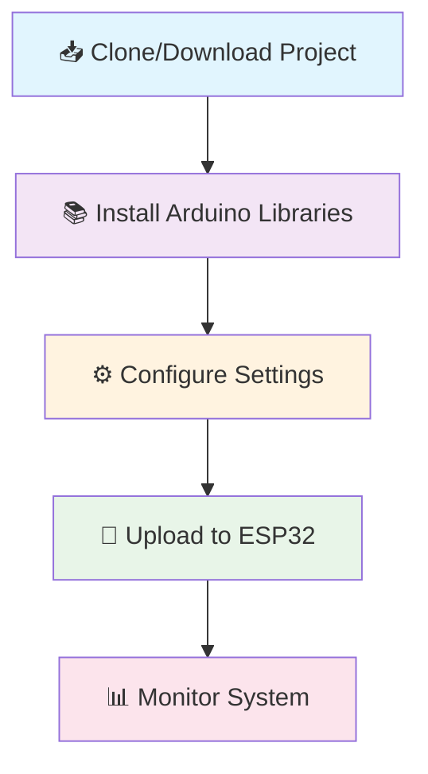
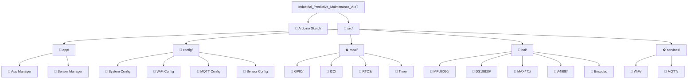
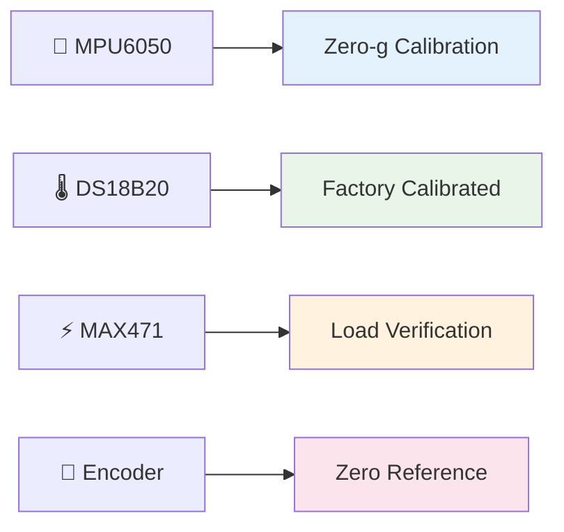
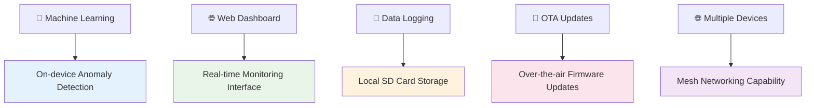

# 🏭 Industrial Predictive Maintenance AIoT System

<div align="center">


*A comprehensive ESP32-based Industrial Predictive Maintenance system for real-time equipment monitoring and fault detection*

</div>

---

## 🖼️ Project Gallery

<div align="center">

### 📸 **Hardware Setup**
<!-- 📸 ADD YOUR HARDWARE PHOTO HERE -->
<!-- 

*Complete hardware setup with ESP32 and all sensors connected*
-->

<br>

### 🔌 **Circuit Diagram**
<!-- 📸 ADD YOUR CIRCUIT DIAGRAM HERE -->
<!-- 

*Detailed wiring diagram for all components*
-->

<br>

### 📊 **Monitoring Dashboard**
<!-- 📸 ADD YOUR DASHBOARD SCREENSHOT HERE -->
<!-- 

*Real-time monitoring dashboard showing sensor data and system status*
-->


---

## 📋 Overview

A comprehensive ESP32-based Industrial Predictive Maintenance system that monitors equipment health through multiple sensors and provides real-time data analysis via MQTT connectivity. This system is designed for industrial environments where equipment reliability and predictive maintenance are critical.

---

## 🏗️ System Architecture

<div align="center">

### **Layered Architecture Design**



#### **🏗️ Layer-by-Layer Breakdown**

<div align="center">

| Layer | Components | Responsibilities | Key Technologies |
|-------|------------|------------------|-------------------|
| **📱 Application** | App Manager, Sensor Manager, Task Manager | System orchestration, sensor data coordination, task scheduling | FreeRTOS, C++ Objects |
| **🌐 Services** | WiFi Service, MQTT Client, RTOS Utils | Network connectivity, data transmission, real-time operations | WiFi, MQTT, FreeRTOS |
| **🔧 Hardware** | MPU6050, DS18B20, MAX471, A4988, Encoder | Sensor data acquisition, actuator control, hardware interfaces | I2C, OneWire, ADC, GPIO |
| **⚙️ MCAL** | GPIO, I2C, Timer | Low-level hardware abstraction, register manipulation, timing control | ESP32 Peripherals, Registers |

</div>

#### **🔄 Data Flow Between Layers**



#### **📋 Layer Responsibilities**

<div align="center">

**📱 Application Layer**
- **System State Management** - Overall system health and status
- **Task Coordination** - Managing FreeRTOS tasks and synchronization
- **Data Processing** - Sensor data aggregation and formatting
- **User Interface** - LED indicators, button handling
- **Error Handling** - System-level error detection and recovery

**🌐 Services Layer**
- **Network Management** - WiFi connection, MQTT client management
- **Data Transmission** - JSON formatting, MQTT publishing/subscribing
- **Real-time Operations** - Timing, delays, critical sections
- **Inter-layer Communication** - Message passing between layers

**🔧 Hardware Abstraction Layer (HAL)**
- **Sensor Drivers** - MPU6050, DS18B20, MAX471, Encoder implementations
- **Actuator Control** - A4988 stepper motor driver interface
- **Data Validation** - Sensor data validation and calibration
- **Hardware Initialization** - Component setup and configuration

**⚙️ Microcontroller Abstraction Layer (MCAL)**
- **GPIO Operations** - Digital input/output, pin configuration
- **I2C Communication** - Bus management, device addressing
- **Timer Management** - Hardware timers, delays, timestamps
- **Register Access** - Direct ESP32 peripheral register manipulation

</div>

#### **🔗 Inter-Layer Communication**

<div align="center">



**🔄 Communication Methods:**
- **Synchronous Calls** - Direct function calls between layers
- **Asynchronous Events** - Callbacks and interrupts from hardware
- **Message Queues** - FreeRTOS queues for inter-task communication
- **Shared Memory** - Global variables and data structures

</div>

#### **�️ Design Benefits**

<div align="center">

| Benefit | Description | Implementation |
|---------|-------------|----------------|
| **🔒 Modularity** | Each layer has specific responsibilities | Clear interfaces, minimal dependencies |
| **🔄 Reusability** | Components can be reused across projects | Hardware-agnostic design |
| **🧪 Testability** | Individual layers can be tested in isolation | Mock objects, unit tests |
| **📈 Scalability** | Easy to add new sensors or features | Plugin architecture |
| **🛠️ Maintainability** | Changes isolated to specific layers | Minimal impact analysis |

</div>

</div>

---

## �🔧 Hardware Components

<div align="center">

### **Core Controller**

*Main processing unit with WiFi & Bluetooth*

### **Sensors & Actuators**

| Component | Model | Interface | Purpose |
|-----------|-------|-----------|---------|
| 📳 **Vibration** | MPU6050 | I2C | Equipment vibration monitoring |
| 🌡️ **Temperature** | DS18B20 | OneWire | Operating temperature tracking |
| ⚡ **Power** | MAX471 | Analog | Current/voltage monitoring |
| 🔄 **Motor Driver** | A4988 | Digital | Precision motor control |
| 📍 **Position** | Encoder | Digital | Rotation/position feedback |

### **Status Indicators**
- 🟢 **System Status LED** - Normal operation
- 🔴 **Fault LED** - Error conditions
- 🔄 **System Button** - Manual control

</div>

---

## 🔌 Pin Configuration

<div align="center">

### **ESP32 Pin Mapping**

| ESP32 Pin | Component | Function | Mode |
|------------|-----------|-----------|------|
| 📍 GPIO 21 | MPU6050 SDA | I2C Data | I2C |
| 📍 GPIO 22 | MPU6050 SCL | I2C Clock | I2C |
| 📍 GPIO 4 | DS18B20 Data | OneWire | Digital |
| 📍 GPIO 32 | MAX471 Current | Analog In | ADC |
| 📍 GPIO 33 | MAX471 Voltage | Analog In | ADC |
| 📍 GPIO 26 | A4988 Step | Motor Step | Digital |
| 📍 GPIO 27 | A4988 Direction | Motor Direction | Digital |
| 📍 GPIO 25 | A4988 Enable | Motor Enable | Digital |
| 📍 GPIO 14 | A4988 MS1 | Microstep 1 | Digital |
| 📍 GPIO 12 | A4988 MS2 | Microstep 2 | Digital |
| 📍 GPIO 13 | A4988 MS3 | Microstep 3 | Digital |
| 📍 GPIO 19 | Encoder Output | Position Signal | Digital |
| 📍 GPIO 2 | Status LED | System Status | Digital |
| 📍 GPIO 15 | Fault LED | Error Indicator | Digital |
| 📍 GPIO 0 | System Button | Manual Control | Digital |

</div>

---

## 📊 Data Flow Architecture

<div align="center">



</div>

---

## 🌐 Network Configuration

<div align="center">

### **MQTT Broker Setup**


- **🌐 External Broker**: `98.88.118.16:1883`
- **🆔 Client ID**: `esp32_industrial`
- **🔐 Authentication**: Enabled with username/password

### **MQTT Topics**
| Topic | Purpose | Frequency |
|-------|---------|-----------|
| `sensors/data` | Real-time sensor readings | 1Hz |
| `motor/control` | Motor control commands | On-demand |
| `faults/alert` | Fault notifications | Event-driven |
| `system/status` | System health status | 10Hz |

</div>

### **Data Format**
```json
{
  "timestamp": 1640995200000,
  "vibration": {
    "x": 0.123,
    "y": -0.456,
    "z": 0.789
  },
  "temperature": 42.5,
  "power": {
    "current": 1.23,
    "voltage": 12.6,
    "watts": 15.5
  },
  "encoder": {
    "pulses": 1024,
    "revolutions": 2.56
  }
}
```

---

## 🚀 Quick Start Guide

<div align="center">

### **📋 Prerequisites**


- Arduino IDE 2.0+
- ESP32 Board Manager
- Required Libraries (see below)

### **🔧 Installation Steps**



</div>

### **Installation Steps**

<div align="center">



</div>

1. **📥 Clone/Download Project**
   ```bash
   git clone [repository-url]
   cd Industrial_Predictive_Maintenance_AIoT
   ```

2. **📚 Install Arduino Libraries**
   <div align="center">
   
   
   
   
   
   
   
   </div>

3. **⚙️ Configure Settings**
   ```cpp
   // src/config/wifi_config.h
   #define WIFI_SSID "YourWiFiNetwork"
   #define WIFI_PASSWORD "YourWiFiPassword"
   
   // src/config/mqtt_config.h
   #define MQTT_CLIENT_BROKER_HOST "98.88.118.16"
   #define MQTT_CLIENT_USERNAME "esp32_user"
   #define MQTT_CLIENT_PASSWORD "esp32_pass123"
   ```

4. **🔌 Upload to ESP32**
   - Open `Industrial_Predictive_Maintenance_AIoT.ino`
   - Select ESP32 board
   - Upload sketch

5. **📊 Monitor System**
   - Open Serial Monitor (115200 baud)
   - Check MQTT connection status
   - Verify sensor data transmission

---

## 📁 Project Structure

<div align="center">



</div>

---

## 🛠️ Technical Specifications

<div align="center">

### **⚡ System Performance**


| Metric | Value | Unit |
|--------|-------|------|
| 📊 **Sampling Rate** | 100 | Hz |
| 📡 **Data Transmission** | 1 | Hz |
| ⚡ **Response Time** | <100 | ms |
| 🔋 **Power Consumption** | ~200 | mA @ 5V |

### **🌐 Communication Protocols**


| Protocol | Standard | Speed/Frequency |
|-----------|----------|-----------------|
| 📶 **WiFi** | 802.11 b/g/n | 2.4GHz |
| 🌐 **MQTT** | v3.1.1 | QoS 1 |
| 🔌 **I2C** | Standard Mode | 400kHz |
| 📡 **OneWire** | DS18B20 Protocol | - |

### **🌡️ Environmental Specifications**


| Spec | Range | Notes |
|------|-------|-------|
| 🌡️ **Operating Temp** | -40°C to +85°C | Industrial grade |
| 💧 **Humidity** | 10% to 90% RH | Non-condensing |
| ⚡ **Power Supply** | 5V DC ±10% | Stable supply required |
| 🛡️ **Protection** | IP20 | Indoor use only |

</div>

---

## 🔧 Calibration & Maintenance

<div align="center">

### **🔧 Sensor Calibration**



### **📅 Maintenance Schedule**

| Frequency | Task | Status |
|-----------|------|--------|
| 📅 **Daily** | Check MQTT connectivity |  |
| 📅 **Weekly** | Verify sensor data accuracy |  |
| 📅 **Monthly** | Inspect physical connections |  |
| 📅 **Quarterly** | Update firmware if needed |  |

</div>

---

## 🚨 Troubleshooting

<div align="center">

### **🔍 Common Issues & Solutions**

| Problem | Possible Cause | Solution | Difficulty |
|---------|---------------|----------|------------|
| 📶 **No WiFi connection** | Incorrect credentials | Check `wifi_config.h` |  |
| 🌐 **MQTT connection fails** | Broker unreachable | Verify broker IP/port |  |
| 📊 **Sensor data missing** | Wiring issue | Check pin connections |  |
| 🔄 **Motor not responding** | Driver fault | Verify A4988 connections |  |
| 💥 **System crashes** | Memory overflow | Check FreeRTOS stack size |  |

### **🐛 Debug Mode**
Enable serial debugging by setting:
```cpp
#define DEBUG_ENABLED true
```

</div>

---

## 📈 Future Enhancements

<div align="center">

### **🚀 Planned Features**



| Feature | Status | Priority |
|---------|--------|----------|
| 🤖 **ML Integration** |  |  |
| 🌐 **Web Dashboard** |  |  |
| 💾 **Data Logging** |  |  |
| 🔄 **OTA Updates** |  |  |
| 🌐 **Multiple Devices** |  |  |

### **🔧 Hardware Extensions**

| Extension | Status | Benefits |
|-----------|--------|----------|
| 🌡️ **Additional Sensors** |  | More monitoring capabilities |
| ⚡ **Actuator Control** |  | Automated responses |
| 🔋 **Power Management** |  | Battery backup, solar |
| 🏠 **Enclosure** |  | IP65 industrial housing |

</div>

---

## 📞 Support & Contributing

<div align="center">

### **🆘 Getting Help**


- 📖 **Documentation**: Check this README first
- 🐛 **Issues**: Report bugs via GitHub Issues
- 💬 **Community**: Join our Discord/Slack channel

### **🤝 Contributing**


</div>

---

## 📄 License

<div align="center">


This project is licensed under the MIT License - see the [LICENSE](LICENSE) file for details.

</div>

---

## 🙏 Acknowledgments

<div align="center">

### **🏆 Special Thanks**


- **ESP32 Arduino Core** - For excellent hardware abstraction
- **FreeRTOS** - Real-time operating system
- **MQTT Protocol** - Lightweight messaging
- **Sensor Manufacturers** - MPU6050, DS18B20, MAX471, A4988

</div>

---

## 📊 Project Statistics

<div align="center">

### **📈 Development Metrics**


| Metric | Value | Unit |
|--------|-------|------|
| 📝 **Lines of Code** | 3,000+ | LOC |
| ⏱️ **Development Time** | 6 | months |
| 🔍 **Supported Sensors** | 5 | types |
| 📊 **Data Points** | 10+ | parameters |
| 🔄 **Update Frequency** | Real-time | continuous |

### **🎯 Project Health**


</div>

---

<div align="center">

### **🎉 Thank you for using Industrial Predictive Maintenance AIoT System!**

*Last Updated: January 2026*  
*Version: 1.0.0*  
*Made with ❤️ for Industrial IoT*

</div>
